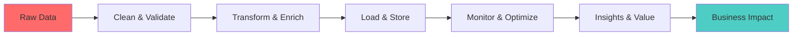

<div align="center">
  
</div>

<div align="center">
  
</div>

<div align="center">
  
</div>

<div align="center">

  
  
  

</div>

---

## 🚀 About Me


```python
class DataEngineer:
    def __init__(self):
        self.name = "Nguyễn Văn Tiến"
        self.role = "Data Engineer"
        self.language_spoken = ["vi_VN", "en_US"]
        self.code = {
            "backend": ["Python", "Java"],
            "database": ["PostgreSQL", "MongoDB", "SQL Server"],
            "big_data": ["Apache Spark", "Hadoop", "Kafka"],
            "orchestration": ["Apache Airflow"],
            "containerization": ["Docker", "Kubernetes"],
            "ml_frameworks": ["TensorFlow", "Scikit-learn", "Pandas", "NumPy"],
            "tools": ["Jupyter", "Notion", "FastAPI", "Flask"]
        }
        self.current_focus = "Data Science & Machine Learning"
        
    def say_hi(self):
        print("Thanks for dropping by! Let's build something amazing together.")

me = DataEngineer()
me.say_hi()
```

<div align="center">
  
</div>

---

## 🛠️ Tech Stack & Arsenal

<div align="center">

### 💻 Programming Languages
<p>
  
  
  
</p>

### 🗄️ Databases & Storage
<p>
  
  
  
  
</p>

### ☁️ Big Data & Streaming
<p>
  
  
  
  
</p>

### 🐳 DevOps & Infrastructure
<p>
  
  
</p>

### 🤖 ML & Data Science
<p>
  
  
  
  
  
</p>

### 🌐 Web Frameworks & APIs
<p>
  
  
  
</p>

### 🛠️ Tools & IDEs
<p>
  
  
  
  
  
</p>

</div>

<div align="center">
  
</div>

<div align="center">
  
</div>

---

## 🌐 Connect & Collaborate

<div align="center">
  <a href="https://linkedin.com/in/tien-nguyen">
    
  </a>
  <a href="https://www.facebook.com/matngu.evrd">
    
  </a>
  <a href="mailto:vantiennguyen1424@gmail.com">
    
  </a>
  <a href="https://discord.gg/your-discord">
    
  </a>
  <a href="https://twitter.com/your-twitter">
    
  </a>
</div>

<div align="center">
  
</div>

### 💼 Professional Contact
<div align="center">
  <table>
    <tr>
      <td align="center">
        
      </td>
    </tr>
    <tr>
      <td align="center">
        
      </td>
    </tr>
  </table>
</div>

---

## 🎯 Current Focus & Goals

<div>

```yaml
Current Status:
  🔭 Working On: Advanced Data Pipeline Architecture & MLOps
  📚 Learning: Machine Learning, Cloud Architecture, DevOps Best Practices, Data Science
  🤝 Open to: Collaborate on Data Engineering & ML Projects
  💬 Ask me about: Python, Data Engineering, Machine Learning, Big Data
  ⚡ Fun Fact: I debug with print statements and I'm not ashamed!
  🎵 Coding Soundtrack: Alternative Rock, Hiphop
```

</div>

<div align="center">
  
</div>

---

## 📊 GitHub Analytics & Performance

<div align="center">
  
  
</div>

<div align="center">
  
</div>

<div align="center">
  
</div>

---

## 🏆 GitHub Achievements & Trophies

<div align="center">
  
</div>

<div align="center">
  
</div>

---

## 💡 Data Engineering Philosophy

<div align="center">
  
</div>


### 🧠 My Data Engineering Principles




---

## 🎵 Currently Jamming To

<div align="center">
  <a href="https://open.spotify.com/user/hlu6gfs21rp9iu5c0vwi9kb7h">
    
  </a>
</div>

---

## 🐍 Contribution Snake Game

<div align="center">
  <picture>
    <source media="(prefers-color-scheme: dark)" srcset="https://raw.githubusercontent.com/NguyenVanTien204/NguyenVanTien204/main/snake.svg">
    <source media="(prefers-color-scheme: light)" srcset="https://raw.githubusercontent.com/NguyenVanTien204/NguyenVanTien204/main/github-contribution-grid-snake.svg">
    
  </picture>
</div>

---

## 🎨 Random Developer Wisdom

<div align="center">
  
</div>

---

## 💬 Let's Talk Data!

<div align="center">
   <em><b>I love connecting with different people</b> so if you want to say <b>hi, I'll be happy to meet you more!</b> 😊</em>
</div>

<div align="center">
  
</div>

---

<div align="center">
  
</div>

<div align="center">
  <h3>🌟 "In God we trust. All others must bring data." - W. Edwards Deming 🌟</h3>
  <p><em>Keep coding, keep learning, keep growing! 🚀</em></p>
</div>
